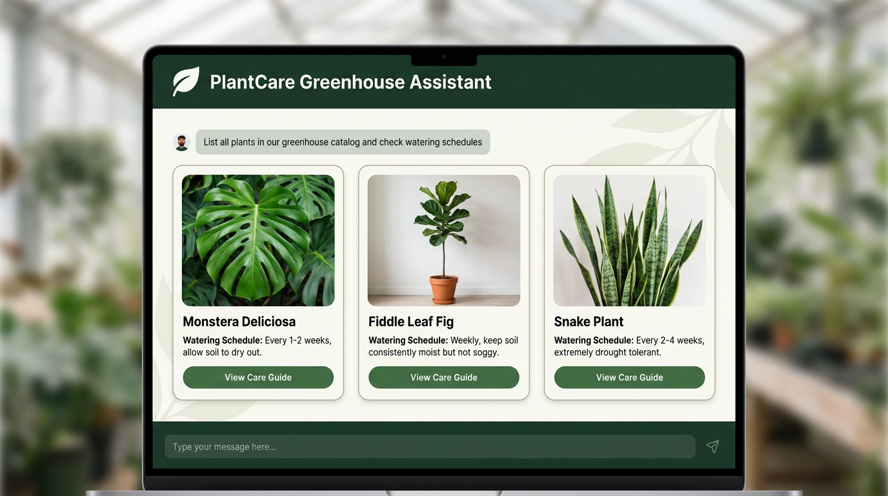

# PlantCare Greenhouse OS 🌿 — All-in-One Botanical Solution

A production-ready conversational AI agent and web application built with Google Agent Development Kit (ADK) and deployed to **Google Cloud Run**.

---

## 🎨 User Interface Preview & Sample Questions



### 💬 Featured Sample Questions (First Impression):
- 🪴 **Sample Question 1**: *"List all plants currently in our greenhouse catalog and check watering schedules."*
- 🩺 **Sample Question 2**: *"My Monstera has yellowing leaves with brown spots, please diagnose its health issue."*

---

## 🌐 Public Live Application

- **Live Public Web OS (Google Cloud Run)**: [https://plantcare-frontend-597874512082.us-east4.run.app](https://plantcare-frontend-597874512082.us-east4.run.app)
- **GitHub Repository**: [https://github.com/mohalkarushikesh/buildwithgemini-plantcare-greenhouse](https://github.com/mohalkarushikesh/buildwithgemini-plantcare-greenhouse)

---

## 🌟 All-in-One Features & Tools (14 Botanical Tools)

1. **🪴 Catalog Management**: Cloud Firestore houseplant catalog (`list_plants`, `get_plant`, `add_plant`).
2. **🩺 Health Diagnostics**: Symptom root cause & care treatment plans (`diagnose_plant_health`).
3. **🪴 Soil Mix Recipe & Repotting**: Chunky aroid/succulent volume % breakdown (`get_soil_mix_recipe`).
4. **🌱 Seed & Stem Propagation**: Cutting nodes, moss substrates, & heat mat settings (`plan_propagation`).
5. **🐛 Pest Treatment Protocols**: Neem oil recipes & isolation schedules for spider mites/thrips (`lookup_pest_treatment`).
6. **🌞 Grow Light Timer Math**: LED DLI, PPFD height, & daily photoperiod hours (`calculate_grow_light_schedule`).
7. **🌡️ Climate & Sensor Telemetry**: Real-time greenhouse temp, humidity %, Lux, CO2, & soil pH (`get_greenhouse_climate_stats`).
8. **🚿 Smart Drip Irrigation**: Solenoid valve timers for greenhouse zones (`schedule_irrigation_task`).
9. **📈 Growth Velocity Analytics**: Height gain %, node velocity, and 90-day trajectory (`compare_plant_growth`).
10. **⚡ Automation Actuator Rules**: Configurable sensor threshold triggers for fans and solenoids (`trigger_automated_greenhouse_rule`).
11. **📊 Executive Operations Report**: Valuation ($), inventory count, & health index (`export_greenhouse_report`).
12. **📥 CSV Catalog Exporter**: One-click download of full plant catalog CSV dataset (`/export-csv`).
13. **🖼️ Imagen 3 Image Generation**: Realistic AI plant photo rendering (`generate_plant_image`).
14. **🧮 Server-Side Code Execution**: Python sandbox for soil moisture schedule calculations (`AgentEngineSandboxCodeExecutor`).

---

## 🎙️ Next-Gen Web OS Capabilities

- **🎙️ Hands-Free Speech-to-Text**: Voice microphone input in chat bar.
- **🔊 Text-to-Speech Voice AI**: Audio speech responses aloud via Web Speech API.
- **📸 Photo AI Vision Diagnosis**: Upload real plant photos for instant Gemini 2.5 Flash visual diagnosis.
- **📊 24-Hour Telemetry Sparkline Charts**: Interactive environmental sensor trends modal.
- **📅 Interactive Care Schedule Calendar**: Visual 30-day watering, fertilizing, and leaf dusting schedule modal.
- **📄 Printable Care Sheet Exporter**: One-click PDF / Printable care tag exporter.

---

## 🖥️ Running as a Local Daemon Service

```bash
./start_daemon.sh   # Runs continuously on http://localhost:8080
./stop_daemon.sh    # Stops background service
```

---

## 🏗️ Architecture & Stack

- **Model Engine**: Gemini 2.5 Flash via Google Cloud Vertex AI (`google-genai`).
- **Catalog Database**: Native Cloud Firestore (`plants` collection).
- **Media Storage**: Public Google Cloud Storage Bucket (`gs://plantcare-media-qwiklabs-gcp-02-99845fbbae24`).
- **Code Execution**: `AgentEngineSandboxCodeExecutor` for safe server-side Python math execution.
- **Visual Interface**: FastAPI proxy with built-in A2UI card renderer.
- **Deployment**: Google Cloud Run in `us-east4`.
